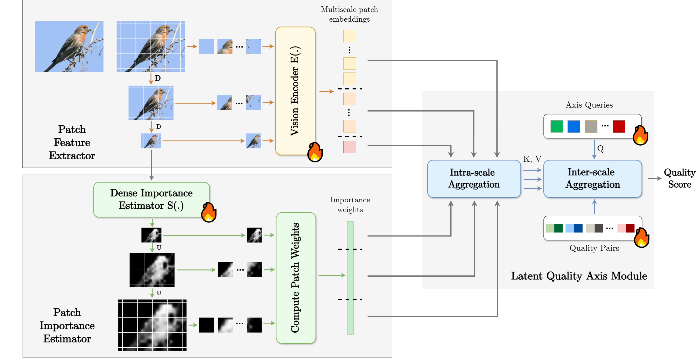

# ReLIQS

Official implementation of **Learning Where to Look and How to Judge: Resolution-agnostic Image Quality Assessment with Quality-aware Saliency** (CVPR 2026).

**Hakan Emre Gedik, Shashank Gupta, Alan Bovik**  
The University of Texas at Austin · University of Colorado Boulder

[Paper](https://openaccess.thecvf.com/content/CVPR2026/papers/Gedik_Learning_Where_to_Look_and_How_to_Judge_Resolution-agnostic_Image_CVPR_2026_paper.pdf) · [CVF Project Page](https://openaccess.thecvf.com/content/CVPR2026/html/Gedik_Learning_Where_to_Look_and_How_to_Judge_Resolution-agnostic_Image_CVPR_2026_paper.html) · [Model Weights](https://huggingface.co/hakanemre/ReLIQS)


## Overview

**ReLIQS** (**Re**solution-agnostic **L**earning for **I**mage **Q**uality with **S**aliency) predicts image quality without a reference image. It combines multiscale image patches, a CLIP vision encoder, learned quality-aware saliency, and latent quality axes to produce an image-level quality score.

- Preserves original-resolution information through patch-based processing.
- Learns spatial importance directly from image-quality supervision.
- Supports joint training across datasets using within-dataset ranking and correlation losses.
- Provides image scoring, saliency visualization, and distributed training.




## Installation

Run all commands from the repository root.

```bash
git clone https://github.com/hakan-emre-gedik/ReLIQS.git
cd ReLIQS

python3 -m venv .venv
source .venv/bin/activate
python -m pip install --upgrade pip
```

Install `torch` and `torchvision` using the [PyTorch installation instructions](https://pytorch.org/get-started/locally/) for your Python version and CUDA driver. Then install the remaining dependencies:

```bash
python -m pip install numpy scipy pandas pillow opencv-python \
    matplotlib plotly timm ftfy regex tqdm packaging huggingface_hub
```

Training uses Linux, NVIDIA GPUs, NCCL, and CUDA bfloat16 autocasting. Use GPUs with bfloat16 support and a PyTorch build providing `torch.amp` and the `device_id` argument of `init_process_group`. The inference scripts select CUDA when available and otherwise use CPU.

The required CLIP and TinyCLIP implementations are included in `clip/` and `tiny_clip/`. Model construction downloads their pretrained backbone weights if they are not already cached, including when loading a ReLIQS checkpoint. Allow internet access on the first run or populate `~/.cache/clip` beforehand on each machine.

## Pretrained Weights

Download a compatible checkpoint from **[Hugging Face — link to be added](https://huggingface.co/YOUR_HF_USERNAME/ReLIQS)** and save it as `model_weights.pth`, or pass its location through `--checkpoint_path`.

Both inference scripts use EMA weights. A checkpoint for image scoring must contain `model_ema` and `patch_sampler_ema`; saliency visualization requires `patch_sampler_ema`.

## Image Quality Prediction

```bash
python score_image.py \
    --checkpoint_path model_weights.pth \
    --image_path /path/to/image.jpg
```

The script prints a scalar as `Score: ...`. Scores are in `[0, 1]`, with higher values indicating better predicted quality. They are model scores rather than values on a particular dataset's original MOS scale.

## Saliency Visualization

```bash
python output_saliency.py \
    --checkpoint_path model_weights.pth \
    --image_path /path/to/image.jpg
```

This saves `saliency.png` in the current directory, overwriting any existing file of that name. The map is resized to the input image dimensions and normalized to an 8-bit grayscale image. Brighter regions have greater learned importance for quality assessment; brightness does not directly represent local quality or distortion severity.

Both scripts default to `model_weights.pth` and `image.jpg`. They read `options/main_training/koniq.json` through the `CONFIG_PATH` constant and do not currently expose a `--config` argument. Update that constant if using a checkpoint with different model settings. Dataset files are not needed for these two interfaces.

## Dataset Preparation

Obtain the datasets separately and prepare image paths and subjective quality labels. The loader currently expects each dataset at:

```text
../vlm_iqa_datasets/<dataset_name>/
```

For example, a KonIQ-only setup can contain:

| Path relative to the repository root | Contents |
| --- | --- |
| `../vlm_iqa_datasets/KONIQ/images/` | Image files |
| `../vlm_iqa_datasets/KONIQ/splits/1/train.csv` | Training annotations |
| `../vlm_iqa_datasets/KONIQ/splits/1/val.csv` | Validation annotations |
| `../vlm_iqa_datasets/KONIQ/splits/1/test.csv` | Test annotations |

The directory under `splits/` is selected by the configuration's `split` value. Annotation filenames must contain `train`, `val`, or `test`, respectively.

Annotation files are **tab-separated and have no header**, despite the `.csv` extension. The loader assigns these columns:

| Column | Meaning |
| --- | --- |
| `name` | Image path relative to the dataset directory, such as `images/example.jpg` |
| `mos` | Numeric quality label, with higher values meaning better quality |
| `distortion`, `scene1`, `scene2`, `scene3` | Metadata columns; unused by the current training code |

Provide the six columns, using placeholders for unused metadata. The loader min-max normalizes quality labels within each annotation file; it does not automatically invert DMOS. SPAQ images are resized to a short edge of 512 pixels by the dataset loader.

**Dataset location:** `Annotated_Dataset.py` currently hard-codes `../vlm_iqa_datasets`. Changing `data.dataset_path` in the JSON alone does not change this location. Use the expected directory, create a symlink to your dataset root, or update `self.path_dataset` in the loader.

**Dataset selection:** `data.dataset_names` and `data.samples` must have matching lengths and ordering. A positive `samples` entry is the per-GPU training batch size for that dataset. Zero disables its training batches, but the dataset remains part of evaluation. The loader constructs train, validation, and test datasets for every listed entry, so all three annotation files must exist even when `samples` is zero.

Keep the other configuration sections unchanged. Split annotations are included in this repository under vlm_iqa_datasets/. The images can be obtained through corrsponding dataset links. 

## Training

Training is launched through `torchrun`. The provided `train.sh` supports both single-machine and multi-machine jobs, with one process per GPU.

### One machine

The default is four GPUs:

```bash
bash train.sh options/main_training/koniq.json runs/koniq
```

To use two specific GPUs:

```bash
CUDA_VISIBLE_DEVICES=0,1 GPUS_PER_NODE=2 \
    bash train.sh options/main_training/koniq.json runs/koniq_2gpu
```

For one GPU, set `GPUS_PER_NODE=1`.

### Multiple machines

Launch the script on **every participating machine**, assigning a unique `NODE_RANK` from `0` to `NNODES - 1`. For four machines with one GPU each, execute the following on each machine, changing `NODE_RANK` appropriately:

```bash
NNODES=4 \
GPUS_PER_NODE=1 \
NODE_RANK=0 \
MASTER_ADDR=10.0.0.1 \
MASTER_PORT=29500 \
bash train.sh options/main_training/koniq.json runs/koniq
```

Replace `10.0.0.1` with the reachable address of the rank-0 machine. All machines must use the same node count, GPUs per node, master address, port, code, configuration, and dataset splits. Each needs access to the datasets and dependencies. A scheduler or SSH launcher can start these commands; `torchrun` does not launch them remotely.

| Environment variable | Default | Purpose |
| --- | --- | --- |
| `NNODES` | `1` | Number of machines |
| `GPUS_PER_NODE` | `4` | GPU processes per machine |
| `NODE_RANK` | `0` for one machine | Unique machine index; required for multiple machines |
| `MASTER_ADDR` | `127.0.0.1` for one machine | Rank-0 address; required for multiple machines |
| `MASTER_PORT` | `29500` | Shared coordination port; choose another for concurrent jobs |

### Batch sizes

For each dataset:

```text
global_batch_size = samples[dataset_index] * NNODES * GPUS_PER_NODE
```

The default KonIQ setting uses 16 images per GPU, giving 64 images across four GPUs. To preserve that global batch size with two GPUs, set its `samples` entry to 32; with one GPU, set it to 64, subject to available memory.

Predictions are gathered across GPUs before computing the ranking and correlation losses. Changing the global batch size therefore changes the loss calculation; ordinary gradient accumulation is not an equivalent replacement.

### Configurations

Configuration files are under `options/main_training/`. The table lists datasets with positive training batch sizes; all entries in `dataset_names` are evaluated.

| Configuration | Training datasets |
| --- | --- |
| `koniq.json` | KonIQ |
| `koniq_spaq_kadid.json` | KonIQ, SPAQ, KADID |
| `koniq_spaq_kadid_live_csiq_bid.json` | KonIQ, SPAQ, KADID, LIVE, CSIQ, BID, CLIVE (`ChallengeDB_release`) |
| `koniq_spaq_uhd.json` | KonIQ, SPAQ, UHD |

Key settings in the supplied configurations:

| Setting | Default | Meaning |
| --- | --- | --- |
| `split` | `1` | Dataset split directory |
| `init_epochs` | `16` | Initial training with both vision encoders frozen |
| `epochs` | `64` | Subsequent end-to-end training epochs |
| `lr` / `weight_decay` | `1e-5` / `1e-3` | AdamW settings |
| `scheduler_T_max` | `5` | Cosine learning-rate scheduler setting |
| `train_num_patches` | `[6, 5, 1]` | Random training patches per scale, largest to smallest |
| `patch_size` / `num_scales` | `224` / `3` | Patch dimensions and number of scales |
| `min_short_edge` | `224` | Smallest-scale short edge |
| `patch_stride` | `0.75` | Controls evaluation grid density; smaller values produce more patches |
| `model_name` / `num_attributes` | `ViT-B/16` / `4` | CLIP backbone and latent quality axes |

The current sampler spaces scale short edges linearly between the input short edge and `min_short_edge`. Evaluation uses a deterministic patch grid and learned pooling weights. It does not currently perform top-k selection; `test_num_patches` and `pool_num_patches` do not control patch counts in the supplied execution path.

## Evaluation and Outputs

`main.py` evaluates the primary and EMA models after the initialization stage and after each end-to-end epoch. It reports SRCC and PLCC on the configured test datasets and writes:

| Output under the run directory | Contents |
| --- | --- |
| `checkpoints/checkpoint_-1.pth` | Weights after the initialization stage |
| `checkpoints/checkpoint_<epoch>.pth` | Weights after each end-to-end epoch, starting at 0 |
| `results/log.csv` | Learning rates and evaluation metrics |
| `results/Plots.html` | Interactive metric plots |
| `train_node_<rank>.log` | Console output from each machine |

Checkpoints contain `model`, `model_ema`, `patch_sampler`, and `patch_sampler_ema`. They currently store model weights only; full training resumption is not implemented. On multiple machines, checkpoints and evaluation results are written by global rank 0.

To score an image with a checkpoint from your own run:

```bash
python score_image.py \
    --checkpoint_path runs/koniq/checkpoints/checkpoint_63.pth \
    --image_path /path/to/image.jpg
```

The repository includes evaluation within training and single-image inference; there is no separate dataset-evaluation CLI in this release. For experimental comparisons, keep dataset splits and preprocessing consistent and use validation data for checkpoint selection.

## Acknowledgments

This implementation builds on CLIP and TinyCLIP. We thank their authors and the creators of the IQA datasets used in this work.

## Citation

If you use ReLIQS in your research, please cite:

```bibtex
@InProceedings{Gedik_2026_CVPR,
    author    = {Gedik, Hakan Emre and Gupta, Shashank and Bovik, Alan},
    title     = {Learning Where to Look and How to Judge: Resolution-agnostic Image Quality Assessment with Quality-aware Saliency},
    booktitle = {Proceedings of the IEEE/CVF Conference on Computer Vision and Pattern Recognition (CVPR)},
    month     = {June},
    year      = {2026},
    pages     = {37507-37517}
}
```
